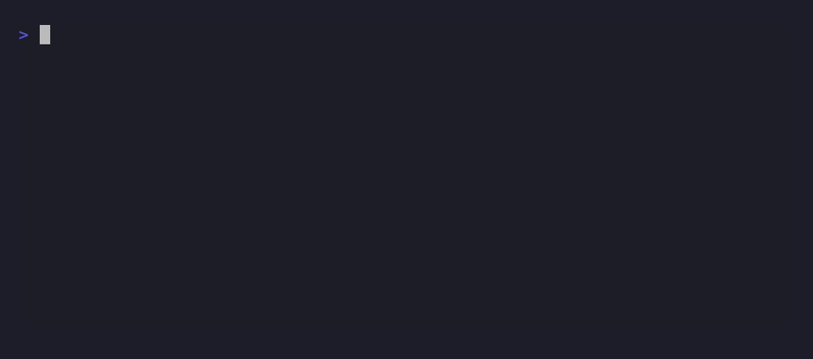

# actually

Cross-checks what your AI agent claims it did against what actually happened.



The recording above is the real binary against a real transcript: the test
run really failed, the claim text really says "All tests pass," and the
mismatch is caught the same way it would be live.

```
$ actually watch -claude-code
actually: watching /Users/you/.claude/projects/.../session.jsonl
actually: claimed tests pass, but the last test run (go test ./...) failed
```

## Why

"Tests pass." "Fixed the bug." "Done." Agents say these things confidently,
and are sometimes wrong — not maliciously, just because the claim and the
verification step silently drifted apart somewhere in a long session. By
the time you notice, you've already trusted the wrong thing for a while.
v1 targets the single most common, most mechanically checkable instance of
this: a claim that tests currently pass.

## How it works

`actually` watches a Claude Code session transcript and tracks two things
as they happen: every `Bash` command that looks like a test run, and every
time the assistant's own text asserts that tests pass. When a claim shows
up, it's checked against the most recent real test run in that same
session:

- **No test has been run yet** — the claim has nothing behind it.
- **The last run failed** — text-pattern matched against the actual
  command output (see below).
- **The last run predates a later file edit** — the verification is stale;
  something changed since it was last actually checked.
- **The last run passed, and nothing changed since** — silent. actually only
  speaks up when something doesn't add up.

There is no ML and no second LLM call involved — every check here is
deterministic pattern matching, same spirit as this project's other tools.

### Pass/fail detection has no shortcut available

You'd expect a tool call's own metadata to say whether the command
succeeded. It doesn't — confirmed directly against a real Claude Code
transcript: a Bash tool result's `is_error` field reflects whether the
*tool call* errored, not the shell command's exit status. Three real,
independently verified failing commands (`git stash create` hitting a lock
conflict, a checkpoint concurrency test failure) all came back
`is_error: false`, and there's no separate structured exit-code field
anywhere in the transcript, either. So this works the only way that's
actually possible: pattern-matching the real output text of known
test-runner formats —

- **Go**: `--- FAIL:`, a bare `FAIL` summary line, `panic:`
- **pytest**: `FAILED`, `N failed` (nonzero N only — `0 failed` in a cargo
  summary line was a real false positive caught during testing)
- **Jest**: `✕`, `N failed`
- **cargo**: `test result: FAILED` / `test result: ok`
- **generic**: `exit status/code N` for nonzero N

A failure marker always wins over a success marker in the same output, so
one failing test among many passing ones is still correctly a failed run.
If the output doesn't match any known pattern, the verdict is `unknown` —
deliberately not guessed, and treated differently from a real failure (see
Known limitations).

### Claim detection has to filter out talking *about* the phrase

A naive substring match on "tests pass" is far noisier than it sounds. Run
against this project's own real conversation history, phrases like *"make
sure tests pass before shipping"*, *"the agent claims tests pass"*, and *"a
second independent test pass"* (a noun phrase — a round of testing, not a
verb) all contain the raw substring without being an actual completion
claim. The claim detector filters these out with a deterministic,
sentence-bounded exclusion list (intent markers like "let's"/"need to",
discussion markers like "claims"/"asserts", and a grammar check that
distinguishes "tests pass" the verb from "test pass" the noun) rather than
guessing at meaning. Tuned and tested against this project's actual
transcript, not just made-up examples — see Verified against real data.

Recognizes "checks" as a synonym for "tests" ("all checks pass" counts the
same as "all tests pass") — added after third-party testing found a claim
phrased without the literal word "test" going uncaught. Same exclusion
handling applies to both.

## Usage

```
actually watch -file PATH [-interval MS]
actually watch -claude-code [-interval MS]
```

- **`-file PATH`** watches a JSONL transcript directly.
- **`-claude-code`** scans every project directory under
  `~/.claude/projects/` and watches whichever `.jsonl` file was modified
  most recently. This is deliberately *not* "encode the current working
  directory and look up its matching folder" — that approach (used by
  [again](https://github.com/Soldsoul86/AAA/tree/main/again) and
  [ctxmeter](https://github.com/Soldsoul86/AAA/tree/main/ctxmeter)) turned
  out to be unreliable: verified directly against a real setup where the
  process's cwd didn't match the directory Claude Code actually keyed the
  session under. Scanning for "whichever session is actively being written
  to" sidesteps the encoding question entirely.

If the path given to `-file` doesn't exist yet, actually keeps polling
rather than exiting — useful if you start watching before the file is
created — but says so explicitly after 5 consecutive misses rather than
running forever with no output. A third-party test of a typo'd path
confirmed the old behavior looked identical to "working, nothing to
report" with zero feedback; this warning is the fix.

## Known limitations

- **v1 only checks "tests pass" claims.** The broader idea — "I added
  error handling to X, does the diff actually touch X?" — is a real next
  step, not built. Narrower and reliable beats broader and guessy.
- **A fixed list of test runners.** `go test`, `npm`/`yarn`/`pnpm test`,
  `pytest`, `cargo test`, `mvn test`/`verify`, `gradle`/`./gradlew test`,
  `rspec`, `jest`, `dotnet test`, `make test`. A custom script
  (`./scripts/check.sh`) won't be recognized as a test command at all —
  deliberately a precise list rather than a loose "contains the word test"
  match, which would misfire on things like `mkdir test`.
- **Unrecognized output is `unknown`, not silently assumed passing.** If a
  test command runs but its output doesn't match any known pattern,
  actually says so explicitly rather than staying quiet — you get a
  distinct "can't verify this" note instead of either a false all-clear or
  a false alarm.
- **Tracks a single "last test run" — not one per test suite.** In a
  polyglot or monorepo project (a Python backend and a JS frontend in the
  same session, say), if `pytest` fails and then `npm test` passes,
  actually only remembers the *most recent* run. A claim like "backend
  tests pass" made right after that `npm test` would be checked against
  the JS run, not the failing Python one, and would wrongly stay silent.
  This is a real limitation for multi-suite sessions, not a contrived
  edge case — scoping test runs to which suite a claim is actually about
  would need the same kind of diff-awareness the staleness limitation
  below is also missing, and is a real next step, not built.
- **Staleness is session-global, not claim-scoped.** *Any* file edit after
  the last test run marks the next claim "stale," even if that edit was
  unrelated setup work for a completely different part of the codebase.
  Confirmed by running against this project's own real session: it flagged
  a genuine "All 9 tests pass" claim as stale, purely because I'd started
  scaffolding an unrelated file afterward before writing that sentence.
  Mechanically correct (the *specific* test run really did predate a later
  edit) but can read as overcautious. Scoping staleness to which files a
  claim is actually about would need real diff-awareness, which is out of
  scope for v1.
- **Claim detection is a word-window heuristic, not language understanding.**
  It's tuned against real false-positive patterns found in this project's
  own transcripts, but a sufficiently unusual phrasing could still slip
  past the exclusion list either direction.
- **Only "tests"/"checks" are recognized — not every synonym for "it
  worked."** "CI is green," "the suite is green," "everything passes"
  aren't caught. These were deliberately left out rather than added
  loosely: "green," in particular, shows up in far too many unrelated
  contexts to add safely without reopening the false-positive problem the
  exclusion list exists to solve. "checks" was added because it's as
  grammatically unambiguous as "tests" in this exact position; "green" and
  similar aren't.
- **Quote detection only catches a phrase immediately inside quote marks,
  not a quoted phrase in the middle of a longer sentence.** Found during
  testing: a sentence *about* a past claim — `a "stale" claim (permit's
  "All 9 tests pass" completion report...)` — still matched, because the
  quote mark isn't adjacent to "tests," it's several words earlier. In
  practice this shows up in meta-discussion (a report describing what
  actually itself found), not in ordinary coding-session transcripts,
  which is why it wasn't worth the added complexity of real quote-span
  tracking to close.

## Verified against real data

Every design decision above was checked against a real, live Claude Code
transcript from this project's own session — not synthetic fixtures. That
included: confirming the actual JSON shape of assistant/tool_use/tool_result
entries, discovering the `is_error` limitation firsthand, running the
finished claim detector against all ~500 real assistant text blocks in that
session (0 false positives on ordinary claims), and running the finished
binary against the entire transcript end to end, which is what surfaced
both the staleness-scoping limitation and the quote-detection limitation
documented above.

A separate black-box pass, run after shipping v0.1.0, installed the tool
fresh via `go install` (not the dev build) and drove it like a first-time
user would: multi-framework end-to-end runs through the real CLI (Go,
pytest, Jest, cargo, each via an actual claim/result pair, not just unit
tests of the underlying packages), true live-append watching (appending to
a growing file while the binary tails it, not just a static fixture),
`-claude-code` against a machine with no Claude Code history, and a typo'd
`-file` path. That pass is what found and fixed the silent-hang-on-missing-
file bug and the "checks" gap described above.

A follow-up pre-release audit tested a transcript line larger than the
scanner's buffer cap (an agent dumping a large file's contents into a tool
result, say) — a real, plausible scenario, not a contrived one. It found
that the old implementation failed silently on that single line and then
silently dropped every line after it for the rest of the session, with
zero error output. Fixed by switching to an unbounded line reader that
tracks exactly how many bytes it's consumed, instead of a fixed-size
buffer — confirmed fixed by rerunning the same oversized-line transcript
and seeing the correct "can't verify this" response instead of silence.

## Install

```
go install github.com/Soldsoul86/AAA/actually@latest
```

(Prebuilt binaries via `install.sh` and Homebrew once this has a tagged release.)

## License

MIT
